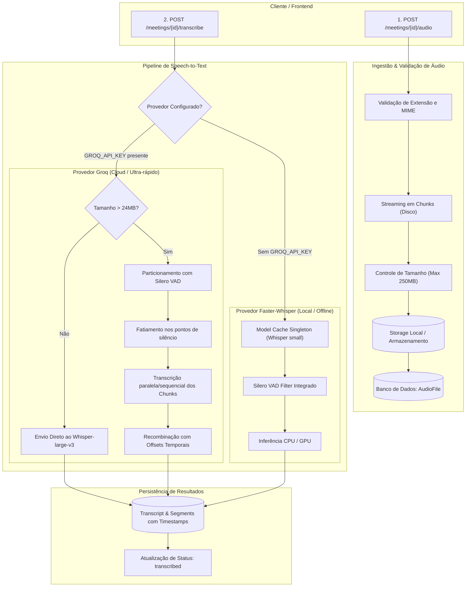

# CortechX Meeting Summarizer

## Backend (Windows)

Com o Python 3.14+ instalado, execute no PowerShell:

```powershell
cd backend
python -m venv .venv
.\.venv\Scripts\Activate.ps1
python -m pip install -e ".[dev]"
fastapi dev app/main.py
```
Para rodar os testes execute no Powershell:

```powershell
python -m pytest
```

A API ficará disponível em `http://127.0.0.1:8000`. Verifique o status em
`http://127.0.0.1:8000/health`.

## Backend (Linux)

Com o Python 3.14+ instalado, execute no terminal:

```bash
cd backend
python3 -m venv .venv
source .venv/bin/activate
python -m pip install -e ".[dev]"
fastapi dev app/main.py
```
Para rodar os testes execute no terminal:

```bash
python -m pytest
```

A API ficará disponível em `http://127.0.0.1:8000`. Verifique o status em
`http://127.0.0.1:8000/health`.

## Upload de Áudio e Formatos Suportados

O endpoint `POST /meetings/{meeting_id}/audio` recebe gravações de reuniões via `multipart/form-data`.

* **Formatos / Extensões Suportadas:** `.mp3`, `.wav`, `.m4a`, `.mp4`, `.webm`.
* **MIME Types Aceitos:** `audio/mpeg`, `audio/wav`, `audio/x-wav`, `audio/mp4`, `audio/x-m4a`, `audio/webm`, `video/mp4`, `video/webm`.
* **Tamanho Máximo Padrão:** `250 MB` (configurável via variável de ambiente `MAX_AUDIO_SIZE_MB`).
* **Validações:** Rejeição imediata de arquivos vazios (0 bytes), arquivos com formatos não suportados e identificadores de reunião inexistentes ou inválidos.

## Speech-to-Text (Transcrição de Áudio)

O pipeline de transcrição é acionado via `POST /meetings/{meeting_id}/transcribe` e suporta dois modos de execução:

1. **Modo Local (Padrão / Offline):**
   - Utiliza `faster-whisper` com o modelo `small`.
   - Inclui **Voice Activity Detection (Silero VAD)** nativo (`vad_filter=True`), que fatia o áudio em segmentos naturais de fala e ignora trechos em silêncio.
   - Não requer chaves externas ou conexão com a internet após o download inicial do modelo.

2. **Modo Nuvem (Ultra-Rápido via Groq):**
   - Utiliza a API da Groq com o modelo `whisper-large-v3`, realizando a transcrição em segundos na nuvem com alta acurácia.
   - Ativado automaticamente ao preencher a variável `GROQ_API_KEY` no `.env`.

### Como obter uma Chave Gratuita da Groq:

1. Acesse o portal oficial: [Groq Console](https://console.groq.com/).
2. Crie uma conta gratuita (login rápido com GitHub ou Google).
3. No menu lateral esquerdo, clique em [API Keys](https://console.groq.com/keys).
4. Clique no botão **"Create API Key"**, atribua um nome (ex: `cortechx-dev`) e clique em **Submit**.
5. Copie a chave gerada (iniciada por `gsk_...`).
6. No seu arquivo `.env` (na raiz do projeto), adicione a chave:
   ```env
   GROQ_API_KEY=gsk_sua_chave_aqui
   ```
> **Nota:** Se `GROQ_API_KEY` estiver vazia ou não informada, o sistema alternará automaticamente para o modo local com `faster-whisper`.

### Decisão Arquitetural: Fluxo de Transcrição (Opção B — Operação Separada)

Adotamos a **Opção B (Operação Separada)** em vez da transcrição síncrona acoplada ao endpoint de upload, com base nas seguintes justificativas:

* **Prevenção de Timeouts HTTP:** Arquivos de reunião de 45 a 60 minutos (até 250 MB) levam alguns minutos para processar localmente em CPU. Executar o STT dentro do request de upload acarretaria erros de timeout (`HTTP 504 Gateway Timeout`) em navegadores, clientes HTTP e proxies reversos (Nginx/Cloudflare).
* **Separação de Responsabilidades (SRP):** O endpoint `POST /meetings/{id}/audio` cuida exclusivamente de I/O de rede, validação de integridade e armazenamento em disco. O endpoint `POST /meetings/{id}/transcribe` é responsável estritamente pela inferência de IA/STT.
* **Resiliência e Reprocessamento:** Falhas na transcrição ou troca de modelo/provedor não exigem que o usuário reenvie o arquivo de áudio. Basta invocar novamente o endpoint de transcrição.
* **Preparação para Assincronismo Futuro:** Como o processamento assíncrono definitivo será introduzido em épico posterior, a rota dedicada `POST /transcribe` já estabelece o contrato perfeito para responder com `202 Accepted` e enfileirar jobs (Celery / Background Tasks) sem alterar o endpoint de upload.
* **Ciclo de Vida Transparente:** Permite que o frontend acompanhe com clareza o estado da reunião:
  `received` ➔ `audio_uploaded` ➔ `transcribing` ➔ `transcribed`.

## Arquitetura do Processamento

O pipeline foi projetado de forma modular e resiliente, separando o ciclo de vida do arquivo de áudio do motor de inteligência artificial:



### Componentes do Pipeline:

1. **Ingestão e Validação Segura de Arquivos (`AudioStorageService`):**
   - **Streaming em Chunks:** Gravação em blocos de 1 MB para proteger a memória RAM contra exaustão ao receber gravações pesadas.
   - **Sanitização de Nomes:** Sanitização de caracteres de risco e limitação de comprimento do nome do arquivo (evitando estouro em sistemas de arquivos e colunas `VARCHAR`).
   - **Controle Concorrente:** Bloqueio contra re-upload ou deleção enquanto o arquivo estiver em processo ativo de transcrição (`409 Conflict`).

2. **Detecção de Atividade de Voz (VAD - Silero VAD):**
   - Elimina trechos longos de silêncio, ruídos de fundo e respirações antes de enviar o áudio ao motor neural.
   - Identifica os pontos exatos de pausas naturais na fala para guiar o fatiamento do áudio.

3. **Particionamento de Áudio para API Cloud (*Audio Chunking*):**
   - APIs de nuvem como a Groq impõem um limite estrito de **25 MB por requisição HTTP**.
   - Arquivos que ultrapassam o teto seguro de 24 MB são automaticamente particionados em janelas temporais baseadas nos silêncios detectados pelo VAD.
   - Cada parte é transcrita individualmente e o motor realiza a **recombinação e ajuste de deslocamento temporal (*offset math*)**, garantindo timestamps contínuos e sem perda de contexto entre as falas.

4. **Gerenciamento Eficiente de Modelos Locais (`faster-whisper`):**
   - Implementa padrão **Singleton (`_MODEL_CACHE`)** para reaproveitar os pesos carregados do modelo Whisper na memória, reduzindo o tempo de inicialização em transcrições consecutivas.

5. **Persistência Estruturada (`TranscriptRepository`):**
   - Armazena a transcrição bruta completa unificada.
   - Salva cada fala fragmentada na tabela `transcript_segments` com metadados de tempo (`start_time`, `end_time`), facilitando as futuras etapas de diarização de locutores e sumarização com LLMs.


## Organização do backend

```text
backend/
│
├── app/
│   ├── main.py                  # Criação da aplicação FastAPI e inclusão de rotas
│   │
│   ├── api/
│   │   └── v1/
│   │       ├── health.py        # Health check da aplicação
│   │       └── meetings.py      # Endpoints de reuniões, upload e transcrição
│   │
│   ├── core/
│   │   ├── config.py            # Configurações com Pydantic Settings e variáveis de ambiente
│   │   └── database.py          # Conexão com o banco SQLAlchemy e sessão
│   │
│   ├── models/                  # Modelos SQLAlchemy (Meeting, AudioFile, Transcript, etc.)
│   │
│   ├── repositories/            # Camada de persistência (MeetingRepository, AudioRepository, TranscriptRepository)
│   │
│   ├── schemas/                 # Schemas Pydantic de entrada e saída
│   │
│   └── services/
│       ├── audio_storage.py     # Armazenamento e validação de arquivos de áudio
│       └── transcription/       # Abstrações e provedores de STT (Faster-Whisper, Groq, Mock)
│
├── tests/                       # Suíte de testes automatizados com pytest
│   ├── conftest.py              # Fixtures e banco de testes SQLite em memória
│   ├── test_audio_upload.py     # Testes de upload, streaming e validações de arquivo
│   ├── test_transcription.py    # Testes unitários do pipeline de transcrição
│   └── test_health.py           # Testes do health check e da documentação automática
│
├── .env.example                 # Modelo centralizado de variáveis de ambiente
├── .gitignore
├── pyproject.toml               # Configuração do projeto, dependências e ferramentas de teste
└── README.md
```