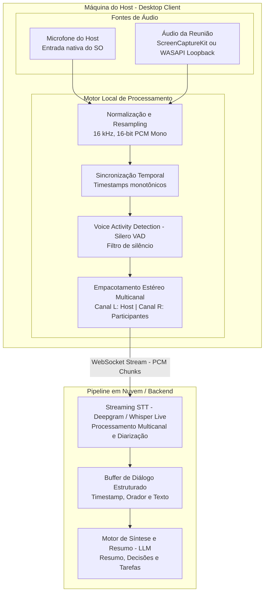

# Arquitetura e Roteiro Técnico: Captura de Áudio e Transcrição no Host

## 1. Visão Geral

Este documento descreve a arquitetura técnica e o roteiro de implementação para o módulo de captura de áudio agnóstico a plataformas de videoconferência do **Cortechx Meeting Summarizer**.

Em vez de depender de bots dedicados para cada plataforma (Google Meet, Microsoft Teams, Zoom, Discord) ou de extensões limitadas, esta abordagem captura o áudio diretamente na máquina do anfitrião (*Host-side Dual Capture*):
1. **Canal 1 (Input):** Microfone do host (voz do anfitrião isolada).
2. **Canal 2 (Output / Loopback):** Áudio dos participantes remotos da chamada (captura direcionada da janela/aplicativo ou saída de som).

---

## 2. Diagrama de Arquitetura



---

## 3. Vantagens Estratégicas desta Abordagem

* **100% Agnóstica:** Funciona com qualquer ferramenta de reunião (Google Meet no Chrome/Brave/Edge, Teams Desktop ou Web, Zoom, Discord, Slack Huddle, chamadas telefônicas via Web, etc.).
* **Invisível e Sem Fricção de Admissão:** Nenhum bot precisa entrar na reunião, pedir autorização ou lidar com bloqueios de compliance corporativo.
* **Diarização por Hardware (Host vs. Resto):** A separação entre o que o Host falou e o que os participantes falaram é garantida fisicamente pela separação dos canais de entrada e saída.
* **Isolamento de Ruído por Processo:** Tecnologias modernas de SO permitem capturar o áudio exclusivo do aplicativo da reunião sem gravar alertas do sistema ou músicas em segundo plano.

---

## 4. Passo a Passo de Implementação

### Passo 1: Definição de Padrões e Stack Técnica

* **Linguagem para Prototipação e PoC:** `Python 3.10+` (para validação rápida de drivers de áudio e conexões WebSocket).
* **Stack Futura de Produção:** `Rust` / `Tauri` (para gerar um cliente desktop ultraleve, com baixo consumo de memória e latência mínima).
* **Padrão de Áudio para Speech-to-Text:**
  * Taxa de amostragem: **16.000 Hz (16 kHz)**
  * Formato: **16-bit Linear PCM (PCM_16)**
  * Estrutura de canais: **2 Canais (Estéreo interleaved: L=Host, R=Participantes)**
  * Tamanho do Chunk: **100 ms a 250 ms** por frame de streaming.

---

### Passo 2: Implementação da Captura do Microfone (Canal 1 - Host)

1. Mapear e listar os dispositivos de entrada de áudio do sistema operacional.
2. Abrir um stream assíncrono de gravação contínua no microfone ativo.
3. **Bibliotecas recomendadas:**
   * Python: `sounddevice` ou `PyAudio`.
   * Rust: `cpal`.

---

### Passo 3: Implementação da Captura do Áudio da Reunião (Canal 2 - Output)

Captura do áudio reproduzido pelos participantes remotos:

#### No macOS (macOS 13+ / Ventura, Sonoma, Sequoia):
* Utilizar a API nativa [`ScreenCaptureKit`](https://developer.apple.com/documentation/screencapturekit).
* Configuração: criar uma sessão com `SCStreamConfiguration.capturesAudio = true` filtrando pela janela ou processo da reunião (ex: Google Chrome, Zoom).
* *Bindings:* PyObjC / subprocesso em Swift / `screencapturekit-rs`.

#### No Windows (Windows 10 / 11):
* Utilizar a API **WASAPI Loopback Capture** (`AUDCLNT_STREAMFLAGS_LOOPBACK`).
* Permite capturar o buffer de áudio antes de ser enviado para a placa de som ou capturar diretamente por Process ID (PID) no Windows 10 build 20348+ e Windows 11.
* *Bindings:* `PyAudioWPatch` ou `wasapi-loopback`.

---

### Passo 4: Sincronização, VAD e Empacotamento Multicanal

1. **Sincronização de Timestamps:**
   * Associar cada chunk de áudio a um timestamp de alta precisão (`monotonic_ns`) para evitar desfasamento entre o microfone e o áudio da chamada.
2. **Voice Activity Detection (VAD):**
   * Processar os frames com **Silero VAD** para detectar pausas e descartar buffers vazios de silêncio, economizando consumo de rede e custo de API.
3. **Composição Estéreo (Multichannel Delivery):**
   * Intercalar as amostras dos dois canais:
     * `Canal 0 (Left)`: Microfone do Host.
     * `Canal 1 (Right)`: Áudio da Reunião (Participantes).

---

### Passo 5: Streaming e Transcrição em Tempo Real (STT)

1. Abrir conexão WebSocket persistente com o provedor de transcrição (ex: **Deepgram Nova-2** com parâmetros `multichannel=true&diarize=true`).
2. Transmitir os frames PCM em tempo real.
3. Processar o payload de retorno:
   * Eventos do `channel 0` são atribuídos automaticamente ao **Host**.
   * Eventos do `channel 1` utilizam a diarização do provedor para diferenciar **Participante 1**, **Participante 2**, etc.

---

### Passo 6: Buffer Estruturado e Geração de Atas com LLM

1. **Estrutura de Diálogo:**
   ```json
   {
     "timestamp": "00:04:12",
     "speaker_role": "host",
     "speaker_label": "Host",
     "text": "Qual é a data limite para entregarmos a primeira versão da API?"
   }
   ```
2. **Pipeline de Sumarização (LLM):**
   * Envio incremental ou por lotes (a cada 5 minutos e ao final da reunião) para um LLM (Gemini / OpenAI / Claude) com prompt especializado em:
     * **Resumo Executivo**
     * **Principais Decisões Tomadas**
     * **Action Items (Tarefas, Responsáveis e Prazos)**
     * **Perguntas em Aberto**
