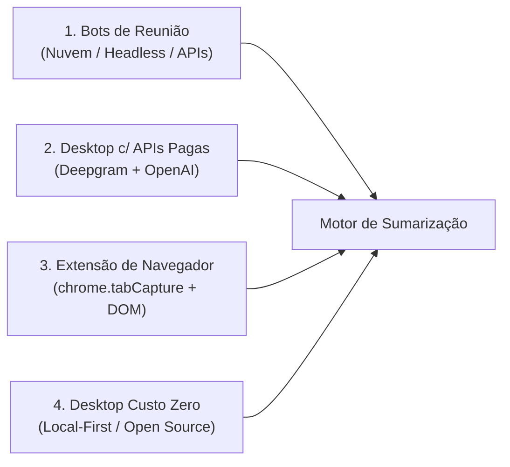
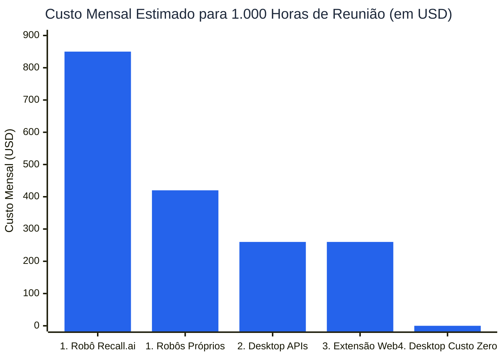
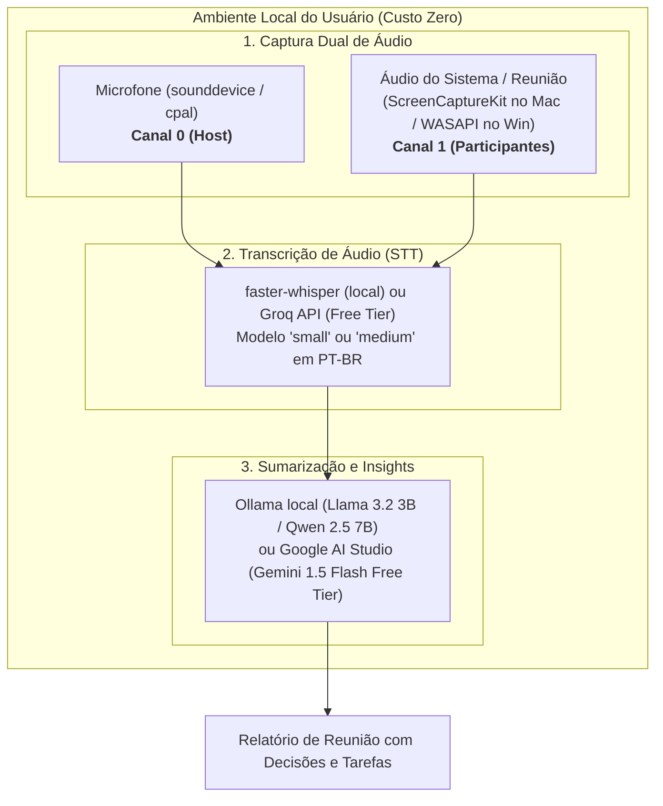

# Estudo Comparativo de Viabilidade: Captura e Sumarização de Reuniões

> **Projeto:** Cortechx Meeting Summarizer  
> **Contexto:** Projeto desenvolvido por equipe de estudantes voluntários.  
> **Objetivo:** Avaliar e comparar abordagens de captura de áudio, transcrição (STT) e sumarização (LLM), com ênfase na viabilidade técnica e no modelo **Custo Zero (100% Open Source / Free Tier)**.

---

## 1. Visão Geral das Abordagens

1. **Opção 1: Bots de Reunião (Participante Virtual na Nuvem)**  
   Instâncias de navegadores headless ou serviços de terceiros (como `Recall.ai`) que entram na sala de reunião como participantes convidados.
2. **Opção 2: Desktop Dual-Stream com APIs Pagas**  
   Aplicativo desktop que captura microfone e saída de áudio, enviando o fluxo estéreo para serviços pagos de transcrição (Deepgram) e LLMs em nuvem.
3. **Opção 3: Extensão de Navegador (Web)**  
   Extensão para Chrome/Edge que captura o áudio da aba da reunião e lê indicadores visuais no DOM do Google Meet / Teams Web.
4. **Opção 4: Desktop 100% Custo Zero (Local-First / Open Source - Recomendada)**  
   Aplicativo desktop que executa todo o pipeline na máquina do usuário (captura de áudio do sistema, transcrição via `faster-whisper` e resumo via `Ollama` ou camada gratuita do `Gemini 1.5 Flash`), operando sem qualquer custo financeiro recorrente.

---

## 2. Matriz Comparativa Geral

| Critério | 1. Bots na Nuvem | 2. Desktop (APIs Pagas) | 3. Extensão Web | 4. Desktop Custo Zero (Local-First) |
| :--- | :--- | :--- | :--- | :--- |
| **Custo Financeiro Recorrente** | Alto (\$420 – \$850/mês) | Médio (~ \$260/mês) | Médio (~ \$260/mês) | **Zero (R$ 0,00)** |
| **Agnóstico à Plataforma** | Baixo (1 conector por app) | Total (qualquer app/web) | Limitado (apenas navegador) | **Total (qualquer app/web)** |
| **Fricção e Privacidade** | Visível (pede admissão) | Invisível (gravação local) | Invisível (gravação na aba) | **Invisível e 100% Privado** |
| **Independência de Internet** | Nula (100% nuvem) | Parcial (requer internet) | Parcial (requer internet) | **Total (pode rodar offline)** |
| **Diarização do Host** | Estimada por modelo | 100% Física (Canal 0) | 100% Física (Canal 0) | **100% Física (Canal 0)** |
| **Diarização dos Participantes**| Alta (em apps com API) | Alta (via STT na nuvem) | Perfeita (via DOM no browser)| Média/Alta (via Silero VAD + Whisper)|
| **Complexidade de Manutenção** | Alta (risco de bloqueios) | Baixa (APIs nativas de SO) | Média (mudanças de DOM) | **Baixa (código aberto e local)** |
| **Tempo Estimado para PoC** | 3 a 4 semanas | 1 a 2 semanas | 1 a 2 semanas | **1 a 2 semanas** |

---

## 3. Comparativo de Custos Operacionais (TCO)

Projeção de custo operacional mensal para um volume de **1.000 horas de reuniões**:

### Detalhamento por Componente:

| Componente | 1. Bots de Terceiros | 1. Bots Próprios | 2. Desktop c/ APIs | 3. Extensão Web | 4. Desktop Custo Zero |
| :--- | :--- | :--- | :--- | :--- | :--- |
| **Infraestrutura / Servidores** | \$0 (incluso) | \$160 | \$0 (roda no cliente) | \$0 (roda no cliente) | **\$0 (roda no cliente)** |
| **Captura de Áudio** | \$750 | \$0 (desenvolvimento) | \$0 (APIs de SO) | \$0 (tabCapture) | **\$0 (APIs de SO)** |
| **Transcrição (STT)** | Incluso ou \$100 | \$260 (Deepgram) | \$260 (Deepgram) | \$260 (Deepgram) | **\$0 (faster-whisper local / Groq Free)** |
| **Sumarização (LLM)** | \$0 a \$50 | \$0 a \$50 | \$0 a \$50 | \$0 a \$50 | **\$0 (Ollama local / Gemini Free Tier)** |
| **Custo Total / 1.000h** | **\$750 – \$850** | **\$420 + Dev** | **~ \$260** | **~ \$260** | **R$ 0,00 (Gratuito)** |

---

## 4. Seção Específica: O Modo 100% Custo Zero

Para atender à realidade de desenvolvimento acadêmico e voluntário, o **Modo Custo Zero** elimina completamente a necessidade de cartões de crédito, servidores pagos e cobranças por minuto de API.

### Arquitetura da Stack Custo Zero:

1. **Captura de Áudio (R$ 0,00):**
   * Utiliza bibliotecas nativas de baixo nível (`ScreenCaptureKit` no macOS 13+ e `WASAPI Loopback` no Windows via Python ou Rust).
   * Não requer drivers virtuais pagos ou placas de áudio adicionais.
2. **Transcrição de Voz para Texto (R$ 0,00):**
   * **Opção Primária (Offline):** `faster-whisper` (CTranslate2). Executa com aceleração CPU/GPU, com baixo uso de RAM (modelo `small` consome cerca de 1 GB a 2 GB de memória).
   * **Opção Secundária (Nuvem Gratuita):** `Groq Cloud Free Tier` (fornece Whisper-large-v3 com limites gratuitos generosos e velocidade ultra-alta).
3. **Detecção de Silêncio e Diarização (R$ 0,00):**
   * `Silero VAD`: modelo open-source leve (menos de 5 MB) para descartar silêncios e otimizar processamento.
   * Separação estéreo por hardware: a fala do Host é garantida fisicamente no Canal 0, enquanto os demais participantes ficam no Canal 1.
4. **Sumarização com LLM (R$ 0,00):**
   * **Local:** `Ollama` com modelos leves e eficientes em português (`Llama-3.2-3B` ou `Qwen-2.5-7B`).
   * **Nuvem Free Tier:** `Google AI Studio` (Gemini 1.5 Flash oferece até 15 requisições por minuto e 1.500 requisições diárias gratuitas sem necessidade de faturamento).

---

## 5. Análise de Pontos Fortes e Fracos

### Opção 1: Bots de Reunião na Nuvem
* **Pontos Fortes:**
  * Não exige instalação de aplicativo na máquina do usuário.
  * Pode ser acionado automaticamente via integração com Google Agenda / Outlook.
* **Pontos Fracos:**
  * Custo elevado e contínuo de infraestrutura ou licenciamento de APIs.
  * Constrangimento social: o bot entra na sala de reunião e pode ser barrado por políticas corporativas.
  * Manutenção complexa devido a bloqueios frequentes de contas e mudanças nas plataformas.

---

### Opção 2: Desktop Dual-Stream com APIs Pagas
* **Pontos Fortes:**
  * Alta precisão de transcrição em tempo real (Deepgram Nova-2).
  * Baixa latência e processamento desacoplado do hardware local.
* **Pontos Fracos:**
  * Custo variável por minuto gravado (inviável para projetos sem orçamento).

---

### Opção 3: Extensão de Navegador
* **Pontos Fortes:**
  * Permite capturar os nomes exatos dos participantes inspecionando o DOM visual da reunião.
  * Fácil distribuição pela Chrome Web Store.
* **Pontos Fracos:**
  * Limitada a chamadas executadas dentro do navegador (não suporta aplicativos desktop como Zoom ou Teams instalados).

---

### Opção 4: Desktop 100% Custo Zero (Recomendada)
* **Pontos Fortes:**
  * **Custo Zero Real:** Sem mensalidades, taxas de API ou despesas com servidores.
  * **Agnóstico:** Funciona com qualquer plataforma (Meet, Zoom, Teams, Discord, Slack, chamadas web).
  * **Privacidade Total:** Os dados de áudio podem ser processados 100% localmente, sem envio de conversas para servidores de terceiros.
  * **Ideal para Equipes Acadêmicas:** Stack baseada em ferramentas open-source consolidadas e com ampla documentação.
* **Pontos Fracos:**
  * Depende do poder computacional da máquina do usuário (recomenda-se processador moderno com ao menos 8 GB de RAM para rodar o Whisper local).
  * Exige que o usuário instale o software no sistema operacional.

---

## 6. Conclusão e Plano de Implementação para a Equipe

A **Opção 4 (Desktop 100% Custo Zero)** é a alternativa mais viável e sustentável para a equipe de estudantes voluntários, pois entrega funcionalidade completa sem criar dependência financeira.

### Roteiro Prático:
1. **Fase 1 (PoC de Áudio em Python):** Validar a captura de microfone e saída de som (ScreenCaptureKit no Mac e WASAPI no Windows).
2. **Fase 2 (Pipeline de Transcrição):** Integrar a captura com `faster-whisper` local e `Silero VAD`.
3. **Fase 3 (Sumarização):** Conectar a saída de texto ao `Ollama` local ou `Gemini 1.5 Flash (Free Tier)`.
4. **Fase 4 (Interface do Usuário):** Criar uma interface gráfica simples (usando `Tauri` ou `CustomTkinter/Flet`) para iniciar e parar gravações com um clique.
