# Documentação de Padronização de Exceções e Classificação de Falhas

Este documento descreve a arquitetura de tratamento de erros, hierarquia de exceções de domínio e os critérios de classificação de falhas implementados no projeto **CortechX Meeting Summarizer** (Issue #26 - Etapas 1 e 2).

---

## 1. Contexto e Objetivos

O pipeline de processamento de reuniões integra múltiplos serviços internos e provedores externos de IA e infraestrutura:

```text
Storage ➔ Speech-to-Text ➔ Diarização ➔ Chunking ➔ LLM ➔ Persistência (DB)
```

Cada etapa está sujeita a falhas de diferentes naturezas. Para garantir a resiliência do sistema e evitar tanto o desperdício de recursos quanto o travamento de execuções, o sistema adota critérios estritos de classificação de falhas:

- **Falha Recuperável (`FailureCategory.RECOVERABLE` / `RecoverableError`):** Falha transitória decorrente de oscilações de rede, indisponibilidade momentânea ou quotas temporárias. O sistema deve efetuar novas tentativas de execução (retry) utilizando políticas controladas (ex: backoff exponencial).
  - *Exemplos:* timeout de requisição, HTTP 429 (rate limit), erro temporário de rede/conexão, indisponibilidade temporária de provedores (HTTP 502, 503, 504).
- **Falha Definitiva (`FailureCategory.DEFINITIVE` / `DefinitiveError`):** Falha estrutural, de autorização ou de validação de dados. O estado não mudará com novas tentativas imediatas. O pipeline **deve abortar imediatamente sem novas tentativas**, poupando custos e tempo.
  - *Exemplos:* formato de áudio inválido ou corrompido, arquivo ou registro ausente (HTTP 404), credenciais ausentes ou inválidas (HTTP 401/403), entrada vazia ou inválida (HTTP 400/422).

---

## 2. Hierarquia de Exceções de Domínio

Todas as exceções do sistema herdam de `ApplicationError` (`app.core.exceptions`). A classificação de falhas é estruturada diretamente na herança orientada a objetos por meio de `RecoverableError` e `DefinitiveError`.

```mermaid
classDiagram
    class ApplicationError {
        +str message
        +bool is_retryable
        +FailureCategory category
        +dict details
    }

    class RecoverableError {
        +bool is_retryable = True
    }

    class DefinitiveError {
        +bool is_retryable = False
    }

    ApplicationError <|-- RecoverableError
    ApplicationError <|-- DefinitiveError

    ApplicationError <|-- TranscriptionError
    ApplicationError <|-- DiarizationError
    ApplicationError <|-- LLMError
    DefinitiveError <|-- PersistenceError
    ApplicationError <|-- ProcessingError

    TranscriptionError <|-- TranscriptionAudioNotFoundError
    DefinitiveError <|-- TranscriptionAudioNotFoundError
    TranscriptionError <|-- TranscriptionAudioCorruptedError
    DefinitiveError <|-- TranscriptionAudioCorruptedError
    TranscriptionError <|-- TranscriptionEmptyResponseError
    DefinitiveError <|-- TranscriptionEmptyResponseError
    TranscriptionError <|-- TranscriptionTimeoutError
    RecoverableError <|-- TranscriptionTimeoutError
    TranscriptionError <|-- TranscriptionRateLimitError
    RecoverableError <|-- TranscriptionRateLimitError
    TranscriptionError <|-- TranscriptionProviderError
    RecoverableError <|-- TranscriptionProviderError

    DiarizationError <|-- DiarizationConfigurationError
    DefinitiveError <|-- DiarizationConfigurationError
    DiarizationError <|-- DiarizationAudioNotFoundError
    DefinitiveError <|-- DiarizationAudioNotFoundError
    DiarizationError <|-- DiarizationEmptyResponseError
    DefinitiveError <|-- DiarizationEmptyResponseError
    DiarizationError <|-- DiarizationAssociationError
    DefinitiveError <|-- DiarizationAssociationError
    DiarizationError <|-- DiarizationProviderError
    DefinitiveError <|-- DiarizationProviderError

    LLMError <|-- LLMConfigurationError
    DefinitiveError <|-- LLMConfigurationError
    LLMError <|-- LLMAuthenticationError
    DefinitiveError <|-- LLMAuthenticationError
    LLMError <|-- LLMTimeoutError
    RecoverableError <|-- LLMTimeoutError
    LLMError <|-- LLMProviderError
    RecoverableError <|-- LLMProviderError
    LLMProviderError <|-- LLMRateLimitError
    LLMError <|-- LLMEmptyResponseError
    DefinitiveError <|-- LLMEmptyResponseError

    PersistenceError <|-- EntityNotFoundError
    PersistenceError <|-- EntityConflictError
    PersistenceError <|-- DatabaseError
    PersistenceError <|-- InvalidPersistenceDataError

    EntityNotFoundError <|-- MeetingNotFoundError
    EntityNotFoundError <|-- TranscriptNotFoundError
    EntityNotFoundError <|-- AudioNotFoundError
    EntityNotFoundError <|-- SummaryNotFoundError
    EntityConflictError <|-- SummaryAlreadyProcessingError

    ProcessingError <|-- ChunkingError
    DefinitiveError <|-- ChunkingError
    ProcessingError <|-- SummarizationError
    DefinitiveError <|-- SummarizationError
    ProcessingError <|-- TaskExtractionError

    SummarizationError <|-- SummarizationEmptyInputError
    SummarizationError <|-- SummarizationChunkProcessingError
    SummarizationError <|-- SummarizationConsolidationError
    SummarizationError <|-- SummarizationInvalidResponseError

    TaskExtractionError <|-- TaskExtractionInvalidResponseError
    DefinitiveError <|-- TaskExtractionInvalidResponseError
    TaskExtractionError <|-- TaskExtractionLLMFailureError
    RecoverableError <|-- TaskExtractionLLMFailureError
```



---

## 3. Classificação de Falhas (Recuperáveis vs Definitivas)

### 3.1 Critérios de Aceitação e Definições

1. **Enum `FailureCategory`:**
   - `RECOVERABLE = "recoverable"`
   - `DEFINITIVE = "definitive"`
2. **Propriedade `category` em `ApplicationError`:**
   - Permite que qualquer erro de domínio exponha dinamicamente sua categoria (`err.category`), correspondendo a `FailureCategory.RECOVERABLE` se `is_retryable is True`, ou `FailureCategory.DEFINITIVE` caso contrário.
3. **Regra de Aborto Imediato para Erros Definitivos:**
   - Erros que herdam de `DefinitiveError` possuem prioridade máxima na análise de decisão. **Nenhum retry será acionado**, mesmo se a exceção definitiva encapsular uma causa com código de rede transitório.

### 3.2 Funções de Classificação

O módulo `app.core.exceptions` disponibiliza utilitários centralizados para inspeção determinística de falhas:

```python
from app.core.exceptions import classify_failure, is_definitive, is_recoverable

# Retorna booleano para controle de loop de retry
if is_recoverable(exc):
    execute_retry()
else:
    abort_immediately()

# Ou verificação explícita de erro definitivo
if is_definitive(exc):
    log_critical_error_and_abort()

# Ou obtenção da categoria para métricas e observabilidade
category = classify_failure(exc)  # FailureCategory.RECOVERABLE ou FailureCategory.DEFINITIVE
```

#### Ordem de Precedência na Avaliação (`is_recoverable`):
1. **Instância de `DefinitiveError`:** Retorna imediatamente `False` (aborto estrito).
2. **Instância de `RecoverableError`:** Retorna imediatamente `True`.
3. **Instância de `ApplicationError`:** Retorna o valor de `bool(error.is_retryable)`.
4. **Códigos de Status HTTP (SDKs Groq, OpenAI, httpx, requests, FastAPI):**
   - `429`, `502`, `503`, `504` ➔ Retorna `True` (Transitório / Recuperável).
   - `400`, `401`, `403`, `404`, `405`, `409`, `422` ➔ Retorna `False` (Definitivo).
5. **Códigos de Status em String (gRPC / Google GenAI):**
   - `RESOURCE_EXHAUSTED`, `UNAVAILABLE`, `DEADLINE_EXCEEDED` ➔ Retorna `True`.
   - `INVALID_ARGUMENT`, `NOT_FOUND`, `PERMISSION_DENIED`, `UNAUTHENTICATED`, `ALREADY_EXISTS` ➔ Retorna `False`.
6. **Exceções Nativas Embutidas do Python:**
   - `TimeoutError`, `ConnectionError`, `ConnectionResetError` ➔ Retorna `True`.
   - `FileNotFoundError`, `ValueError`, `TypeError`, `KeyError`, `AttributeError`, `PermissionError` ➔ Retorna `False`.
7. **Causa Encapsulada (`__cause__`):** Avalia recursivamente a causa raiz (se a exceção principal não tiver sido marcada explicitamente como definitiva).
8. **Fallback Conservador:** Retorna `False` para exceções desconhecidas a fim de evitar loops de retries infinitos.

---

### 3.3 Matriz de Classificação de Exceções de Domínio

| Categoria | Classe de Exceção | Base de Classificação | `is_retryable` | Causa Comum | Ação Recomendada |
| :--- | :--- | :---: | :---: | :--- | :--- |
| **STT** | `TranscriptionTimeoutError` | `RecoverableError` | **Sim** | Timeout de requisição na API Groq | Retry com backoff exponencial |
| **STT** | `TranscriptionRateLimitError` | `RecoverableError` | **Sim** | Rate limit excedido (HTTP 429) | Retry respeitando retry-after |
| **STT** | `TranscriptionProviderError` | `RecoverableError` | **Sim** | Erro de infraestrutura/rede do provedor | Retry controlado |
| **STT** | `TranscriptionAudioNotFoundError` | `DefinitiveError` | Não | Áudio ausente no storage | Abortar imediatamente (HTTP 404) |
| **STT** | `TranscriptionAudioCorruptedError` | `DefinitiveError` | Não | Codec inválido ou bytes corrompidos | Abortar imediatamente (HTTP 422) |
| **STT** | `TranscriptionEmptyResponseError` | `DefinitiveError` | Não | Áudio mudo ou inaudível | Abortar imediatamente (HTTP 422) |
| **Diarização** | `DiarizationConfigurationError` | `DefinitiveError` | Não | `HUGGINGFACE_TOKEN` ausente ou inválido | Abortar imediatamente |
| **Diarização** | `DiarizationAudioNotFoundError` | `DefinitiveError` | Não | Arquivo de áudio não encontrado | Abortar imediatamente (HTTP 404) |
| **Diarização** | `DiarizationAssociationError` | `DefinitiveError` | Não | Falha ao correlacionar turnos | Abortar imediatamente (HTTP 422) |
| **Diarização** | `DiarizationProviderError` | `DefinitiveError` | Não | Falha interna no modelo Pyannote | Abortar imediatamente (HTTP 502) |
| **LLM** | `LLMTimeoutError` | `RecoverableError` | **Sim** | Timeout na chamada ao provedor de IA | Retry com backoff |
| **LLM** | `LLMRateLimitError` | `RecoverableError` | **Sim** | Quota temporária atingida (HTTP 429) | Retry com backoff |
| **LLM** | `LLMProviderError` | `RecoverableError` | **Sim** | Erro de rede ou 5xx retornado pela IA | Retry controlado |
| **LLM** | `LLMConfigurationError` | `DefinitiveError` | Não | Chave ou provedor ausente | Abortar imediatamente (HTTP 503) |
| **LLM** | `LLMAuthenticationError` | `DefinitiveError` | Não | Chave de API inválida (HTTP 401/403) | Abortar imediatamente |
| **LLM** | `LLMEmptyResponseError` | `DefinitiveError` | Não | LLM retornou conteúdo vazio | Abortar imediatamente |
| **Persistência** | `MeetingNotFoundError` | `DefinitiveError` | Não | ID inexistente na tabela `meetings` | Abortar (HTTP 404) |
| **Persistência** | `TranscriptNotFoundError` | `DefinitiveError` | Não | Reunião ainda não transcrita | Abortar (HTTP 409) |
| **Persistência** | `SummaryAlreadyProcessingError` | `DefinitiveError` | Não | Concorrência de sumarização | Abortar (HTTP 409) |
| **Processamento** | `SummarizationEmptyInputError` | `DefinitiveError` | Não | Transcrição vazia recebida | Abortar (HTTP 400) |
| **Processamento** | `SummarizationInvalidResponseError`| `DefinitiveError`| Não | Resposta do LLM não respeitou schema JSON | Abortar |
| **Processamento** | `TaskExtractionLLMFailureError` | `RecoverableError` | **Sim** | Falha transiente na chamada ao LLM | Retry conforme causa do LLM |

---

## 4. Encapsulamento de Erros dos Providers

Nenhuma camada superior (como serviços de orquestração ou rotas FastAPI) lida diretamente com exceções nativas de bibliotecas externas (como `google.genai.errors`, SDK da `Groq`, ou `pyannote.audio`).

### 4.1 Provedor Google Gemini (`GeminiProvider`)
- `errors.ClientError` com códigos 401 e 403 ➔ `LLMAuthenticationError` (Definitiva).
- `errors.ClientError` com código 429 ➔ `LLMRateLimitError` (Recuperável).
- `errors.ServerError` (códigos 500, 502, 503, 504) ➔ `LLMProviderError` (Recuperável).
- Timeouts ➔ `LLMTimeoutError` (Recuperável).

### 4.2 Provedor Groq Whisper (`GroqWhisperService`)
- `groq.RateLimitError` ➔ `TranscriptionRateLimitError` (Recuperável).
- `groq.APITimeoutError` ➔ `TranscriptionTimeoutError` (Recuperável).
- `groq.AuthenticationError` ➔ `TranscriptionProviderError` (Definitiva).
- `groq.BadRequestError` / áudio ilegível ➔ `TranscriptionAudioCorruptedError` (Definitiva).
- `groq.APIStatusError` (5xx) ➔ `TranscriptionProviderError` (Recuperável).

### 4.3 Provedor Local Faster-Whisper (`FasterWhisperService`)
- Arquivo inexistente ➔ `TranscriptionAudioNotFoundError` (Definitiva).
- Erros de decodificação (`InvalidDataError`, formato não reconhecido) ➔ `TranscriptionAudioCorruptedError` (Definitiva).
- Falhas de execução ➔ `TranscriptionProviderError` (Definitiva/Recuperável dependendo da causa).

### 4.4 Provedor Pyannote (`PyannoteDiarizationProvider`)
- Ausência de `HUGGINGFACE_TOKEN` ➔ `DiarizationConfigurationError` (Definitiva).
- Falha ao carregar o modelo ou inferência ➔ `DiarizationProviderError` (Definitiva).
- Segmentos vazios retornados ➔ `DiarizationEmptyResponseError` (Definitiva).

---

## 5. Mapeamento para a Camada HTTP (FastAPI)

Na camada de API (`app/api/v1/meetings.py`), as exceções de domínio são mapeadas para os respectivos códigos HTTP:

| Exceção de Domínio | Status HTTP | Detalhe |
| :--- | :---: | :--- |
| `MeetingNotFoundError`, `AudioNotFoundError` | `404 Not Found` | Recurso não localizado |
| `TranscriptNotFoundError`, `SummaryAlreadyProcessingError` | `409 Conflict` | Conflito de estado da reunião |
| `TranscriptionAudioCorruptedError`, `DiarizationAssociationError` | `422 Unprocessable` | Dados não processáveis |
| `TranscriptionEmptyResponseError` | `422 Unprocessable` | Áudio inaudível ou sem voz |
| `TranscriptionProviderError`, `DiarizationProviderError` | `502 Bad Gateway` | Falha em serviço dependente |
| `LLMConfigurationError` | `503 Service Unavailable` | Serviço LLM não configurado |
| `DatabaseError` | `500 Internal Error` | Erro de transação/persistência |

---

## 6. Boas Práticas para o Código da Aplicação

1. **Evitar `except Exception` genérico:** Tratar especificamente as exceções esperadas (`LLMError`, `TranscriptionError`, `DefinitiveError`, etc.).
2. **Sempre encadear exceções:** Usar `raise NovaExcecao(...) from exc` para manter o traceback e a causa original da falha.
3. **Utilizar `is_recoverable(exc)`:** Nas rotinas de orquestração e background workers para decidir se uma operação deve ser reenfileirada para retry ou abortada definitivamente.
4. **Erros definitivos nunca sofrem retry:** Respeitar a regra de aborto imediato para falhas estruturais, de permissão ou de parâmetros inválidos.
