# Documentação de Padronização de Exceções e Tratamento de Erros

Este documento descreve a arquitetura de tratamento de erros e a estrutura hierárquica de exceções de domínio implementada no projeto **CortechX Meeting Summarizer** (Issue #26 - Etapa 1).

---

## 1. Contexto e Objetivos

O pipeline de processamento de reuniões integra múltiplos serviços internos e provedores externos de IA e infraestrutura:

```text
Storage ➔ Speech-to-Text ➔ Diarização ➔ Chunking ➔ LLM ➔ Persistência (DB)
```

Cada etapa está sujeita a diferentes tipos de falha:
- **Falhas Transitórias (Temporárias / Retryable):** Indisponibilidade de API de terceiros, timeouts de rede, rate limit (HTTP 429), instabilidade passageira no servidor (HTTP 5xx). Devem ser elegíveis para mecanismos controlados de retry.
- **Falhas Definitivas (Permanentes / Non-Retryable):** Arquivo de áudio corrompido ou inexistente, credenciais ausentes ou inválidas (HTTP 401/403), reuniões inexistentes (404), esquemas de dados inválidos ou violações de integridade. Retentativas nessas falhas são inúteis e apenas desperdiçam recursos e tempo.

Para que o sistema distinga essas situações sem depender do uso genérico de `Exception` ou inspeção manual de mensagens em string, foi introduzida uma hierarquia unificada com base em `ApplicationError`.

---

## 2. Hierarquia de Exceções de Domínio

Todas as exceções do sistema herdam de `ApplicationError` (`app.core.exceptions`).

```mermaid
classDiagram
    class ApplicationError {
        +str message
        +bool is_retryable
        +dict details
    }

    class TranscriptionError {
        +bool is_retryable
    }
    class DiarizationError {
        +bool is_retryable
    }
    class LLMError {
        +bool is_retryable
    }
    class PersistenceError {
        +bool is_retryable
    }
    class ProcessingError {
        +bool is_retryable
    }

    ApplicationError <|-- TranscriptionError
    ApplicationError <|-- DiarizationError
    ApplicationError <|-- LLMError
    ApplicationError <|-- PersistenceError
    ApplicationError <|-- ProcessingError

    TranscriptionError <|-- TranscriptionAudioNotFoundError
    TranscriptionError <|-- TranscriptionAudioCorruptedError
    TranscriptionError <|-- TranscriptionEmptyResponseError
    TranscriptionError <|-- TranscriptionTimeoutError
    TranscriptionError <|-- TranscriptionRateLimitError
    TranscriptionError <|-- TranscriptionProviderError

    DiarizationError <|-- DiarizationConfigurationError
    DiarizationError <|-- DiarizationAudioNotFoundError
    DiarizationError <|-- DiarizationEmptyResponseError
    DiarizationError <|-- DiarizationAssociationError
    DiarizationError <|-- DiarizationProviderError

    LLMError <|-- LLMConfigurationError
    LLMError <|-- LLMAuthenticationError
    LLMError <|-- LLMTimeoutError
    LLMError <|-- LLMProviderError
    LLMProviderError <|-- LLMRateLimitError
    LLMError <|-- LLMEmptyResponseError

    PersistenceError <|-- EntityNotFoundError
    PersistenceError <|-- EntityConflictError
    PersistenceError <|-- DatabaseError
    PersistenceError <|-- InvalidPersistenceDataError

    EntityNotFoundError <|-- MeetingNotFoundError
    EntityNotFoundError <|-- TranscriptNotFoundError
    EntityNotFoundError <|-- AudioNotFoundError
    EntityNotFoundError <|-- SummaryNotFoundError
    EntityConflictError <|-- SummaryAlreadyProcessingError

    ProcessingError <|-- ChunkingError
    ProcessingError <|-- SummarizationError
    ProcessingError <|-- TaskExtractionError

    SummarizationError <|-- SummarizationEmptyInputError
    SummarizationError <|-- SummarizationChunkProcessingError
    SummarizationError <|-- SummarizationConsolidationError
    SummarizationError <|-- SummarizationInvalidResponseError

    TaskExtractionError <|-- TaskExtractionInvalidResponseError
    TaskExtractionError <|-- TaskExtractionLLMFailureError
```



---

## 3. Matriz de Classificação: Falhas Transitórias vs Definitivas

| Categoria | Classe de Exceção | `is_retryable` | Causa Comum | Ação Recomendada |
| :--- | :--- | :---: | :--- | :--- |
| **STT** | `TranscriptionTimeoutError` | **Sim** | Timeout de requisição HTTP na API Groq | Retry com backoff exponencial |
| **STT** | `TranscriptionRateLimitError` | **Sim** | Rate limit excedido (HTTP 429) | Retry respeitando retry-after ou backoff |
| **STT** | `TranscriptionProviderError` | **Sim** | Erro interno do servidor (5xx) ou rede | Retry controlado |
| **STT** | `TranscriptionAudioNotFoundError` | Não | Áudio ausente no storage | Falhar imediatamente (HTTP 404) |
| **STT** | `TranscriptionAudioCorruptedError` | Não | Codec inválido ou bytes corrompidos | Falhar imediatamente (HTTP 422) |
| **STT** | `TranscriptionEmptyResponseError` | Não | Áudio mudo ou sem fala detectada | Falhar imediatamente (HTTP 422) |
| **Diarização** | `DiarizationConfigurationError` | Não | `HUGGINGFACE_TOKEN` ausente ou vazio | Falhar imediatamente |
| **Diarização** | `DiarizationAudioNotFoundError` | Não | Arquivo de áudio não encontrado | Falhar imediatamente (HTTP 404) |
| **Diarização** | `DiarizationAssociationError` | Não | Falha ao correlacionar turnos a segmentos | Falhar imediatamente (HTTP 422) |
| **Diarização** | `DiarizationProviderError` | Não | Erro de inferência no Pyannote | Falhar imediatamente (HTTP 502) |
| **LLM** | `LLMTimeoutError` | **Sim** | Timeout na chamada ao provedor de IA | Retry com backoff |
| **LLM** | `LLMRateLimitError` | **Sim** | Quota temporária atingida (HTTP 429) | Retry com backoff |
| **LLM** | `LLMProviderError` | **Sim** | Erro de rede ou 5xx retornado pela IA | Retry controlado |
| **LLM** | `LLMConfigurationError` | Não | Chave ou provedor ausente nas configs | Falhar imediatamente (HTTP 503) |
| **LLM** | `LLMAuthenticationError` | Não | Chave de API inválida (HTTP 401/403) | Falhar imediatamente |
| **LLM** | `LLMEmptyResponseError` | Não | LLM retornou conteúdo vazio | Falhar ou tratar prompt |
| **Persistência** | `MeetingNotFoundError` | Não | ID inexistente na tabela `meetings` | Retornar HTTP 404 |
| **Persistência** | `TranscriptNotFoundError` | Não | Reunião ainda não transcrita | Retornar HTTP 409 |
| **Persistência** | `SummaryAlreadyProcessingError` | Não | Concorrência de sumarização | Retornar HTTP 409 |
| **Processamento** | `SummarizationEmptyInputError` | Não | Transcrição vazia recebida | Retornar HTTP 400 |
| **Processamento** | `SummarizationInvalidResponseError`| Não | Resposta do LLM não respeitou schema JSON | Falhar ou regenerar |
| **Processamento** | `TaskExtractionLLMFailureError` | **Sim** | Chamada ao LLM falhou durante extração | Retry com base na causa do LLM |

---

## 4. Encapsulamento de Erros dos Providers

Nenhuma camada superior (como serviços de orquestração ou rotas FastAPI) deve lidar diretamente com exceções nativas de bibliotecas externas (como `google.genai.errors`, SDK da `Groq`, ou `pyannote.audio`).

### 4.1 Provedor Google Gemini (`GeminiProvider`)
- `errors.ClientError` com códigos 401 e 403 ➔ `LLMAuthenticationError`.
- `errors.ClientError` com código 429 ➔ `LLMRateLimitError` (com `is_retryable=True`).
- `errors.ServerError` (códigos 500, 502, 503, 504) ➔ `LLMProviderError` (com `is_retryable=True`).
- Timeouts ➔ `LLMTimeoutError` (com `is_retryable=True`).

### 4.2 Provedor Groq Whisper (`GroqWhisperService`)
- `groq.RateLimitError` ➔ `TranscriptionRateLimitError` (`is_retryable=True`).
- `groq.APITimeoutError` ➔ `TranscriptionTimeoutError` (`is_retryable=True`).
- `groq.AuthenticationError` ➔ `TranscriptionProviderError` (`is_retryable=False`).
- `groq.BadRequestError` / áudio ilegível ➔ `TranscriptionAudioCorruptedError` (`is_retryable=False`).
- `groq.APIStatusError` (5xx) ➔ `TranscriptionProviderError` (`is_retryable=True`).

### 4.3 Provedor Local Faster-Whisper (`FasterWhisperService`)
- Arquivo inexistente ➔ `TranscriptionAudioNotFoundError`.
- Erros de decodificação (`InvalidDataError`, formato não reconhecido) ➔ `TranscriptionAudioCorruptedError`.
- Falhas de execução ➔ `TranscriptionProviderError`.

### 4.4 Provedor Pyannote (`PyannoteDiarizationProvider`)
- Ausência de `HUGGINGFACE_TOKEN` ➔ `DiarizationConfigurationError`.
- Falha ao carregar o modelo ou inferência ➔ `DiarizationProviderError`.
- Segmentos vazios retornados ➔ `DiarizationEmptyResponseError`.

---

## 5. Mapeamento para a Camada HTTP (FastAPI)

Na camada de API (`app/api/v1/meetings.py`), as exceções de domínio são mapeadas para os respectivos códigos HTTP:

| Exceção de Domínio | Status HTTP | Detalhe |
| :--- | :---: | :--- |
| `MeetingNotFoundError`, `AudioNotFoundError` | `404 Not Found` | Recurso não localizado |
| `TranscriptNotFoundError`, `SummaryAlreadyProcessingError` | `409 Conflict` | Conflito de estado da reunião |
| `TranscriptionAudioCorruptedError`, `DiarizationAssociationError` | `422 Unprocessable` | Dados não processáveis |
| `TranscriptionEmptyResponseError` | `422 Unprocessable` | Áudio inaudível ou sem voz |
| `TranscriptionProviderError`, `DiarizationProviderError` | `502 Bad Gateway` | Falha em serviço dependente |
| `LLMConfigurationError` | `503 Service Unavailable` | Serviço LLM não configurado |
| `DatabaseError` | `500 Internal Error` | Erro de transação/persistência |

---

## 6. Boas Práticas para o Código da Aplicação

1. **Evitar `except Exception` genérico** quando o tipo de erro for conhecido. Tratar especificamente as exceções esperadas (`LLMError`, `TranscriptionError`, `ValidationError`, etc.).
2. **Sempre encadear exceções** usando `raise NovaExcecao(...) from exc` para manter o traceback e o contexto original da falha.
3. **Utilizar `is_retryable`** para decisões de retry nos mecanismos resilientes de orquestração.
