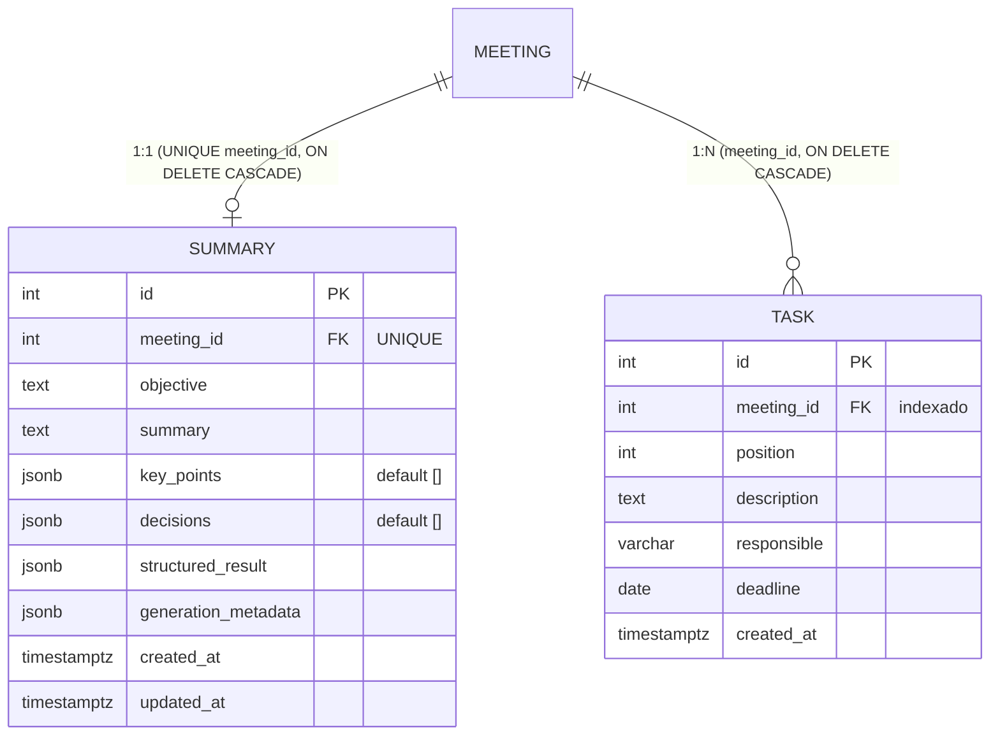

# Persistência do Resultado da Sumarização (`Summary` e `Task`)

Documento de decisão da revisão do model `Summary` e da persistência das tarefas extraídas.

---

## 1. Modelo de dados



## 2. Revisão do `Summary`

| Antes | Depois | Motivo |
|---|---|---|
| `main_ideas` (Text) | `summary` (Text) | Era o antigo `content`, i.e. o texto do resumo. O nome refletia mal o conteúdo; os dados são preservados (rename). |
| `content` (`synonym`) | removido | Alias obsoleto de `main_ideas`, sem uso. |
| — | `key_points` (JSONB) | "Principais pontos" como lista, não como texto solto. |
| — | `decisions` (JSONB) | Lista de decisões tomadas. |
| — | `generation_metadata` (JSONB) | Provider, modelo, versão do prompt, nº de chunks etc. (o schema muda conforme o provider). |
| `structured_result` (JSON) | `structured_result` (JSONB) | Payload completo do pipeline. |
| — | `updated_at` | Reprocessamentos atualizam o mesmo registro. |
| `objective`, `meeting_id`, `created_at` | mantidos | — |

O relacionamento com `Meeting` continua **1:1** (`meeting_id` `UNIQUE`, FK com `ON DELETE CASCADE`).
Reprocessar uma reunião atualiza o `Summary` existente (mesmo `id`) em vez de criar outro.

## 3. Colunas convencionais x JSON/JSONB

**Colunas convencionais** — texto corrido e valores escalares consultados/exibidos diretamente:
`objective`, `summary`, `meeting_id`, `created_at`, `updated_at`.

**JSONB** — estruturas de tamanho variável ou cujo formato pode evoluir:

| Campo | Por quê JSONB e não tabela |
|---|---|
| `key_points` | Lista de strings simples, sempre lida/escrita junto do resumo; não tem identidade nem relacionamentos. |
| `decisions` | Idem. Se no futuro decisões ganharem responsável/status, migram para tabela própria. |
| `structured_result` | Cópia fiel do que o pipeline devolveu; permite auditar/reprocessar sem migration quando o prompt evoluir. |
| `generation_metadata` | Formato varia por provider/modelo. |

**Por que JSONB (e não JSON)?** É binário, indexável (GIN) e suporta operadores (`@>`, `->>`). No código o tipo é
`JSON().with_variant(JSONB(), "postgresql")` (`app/models/json_type.py`), então os testes em SQLite continuam funcionando.

`key_points` e `decisions` são `NOT NULL` com default `[]`, evitando ter que tratar `None` em quem consome.
O resultado **não** é guardado apenas como texto: cada parte tem seu campo estruturado.

> `structured_result` duplica intencionalmente `key_points`/`decisions`/tarefas: os campos dedicados são a
> visão "normalizada" para consumo; `structured_result` é o registro bruto. A fonte para leitura da aplicação são os campos dedicados.

## 4. Persistência das tarefas: entidade própria (`Task`)

**Decisão:** tabela `tasks`, e não uma lista JSON dentro de `Summary`.

```
Meeting ──1:1── Summary
   │
   └──1:N── Task (Task 1, Task 2, ... Task N)
```

Motivos:

* **Integrações (Discord/Notion):** cada tarefa vira uma mensagem/página. Ter linhas com `id` estável permite
  marcar "já enviada", guardar o id externo, editar uma tarefa isolada etc. (colunas futuras) sem reescrever um JSON.
* **Consultas:** "tarefas de Fulano", "tarefas que vencem esta semana" ficam triviais com colunas e índices.
* **Integridade:** FK com `ON DELETE CASCADE`, `description NOT NULL`, tipo `DATE` para prazo.

| Campo | Tipo | Observação |
|---|---|---|
| `id` | int PK | — |
| `meeting_id` | int FK, indexado | `ON DELETE CASCADE`. |
| `position` | int | Ordem devolvida pelo pipeline (a listagem ordena por `position, id`). |
| `description` | text, NOT NULL | — |
| `responsible` | varchar(255), nulo | Nome livre extraído do texto (não existe entidade de usuário). |
| `deadline` | date, nulo | Data já resolvida. |
| `created_at` | timestamptz | — |

**`meeting_id` em vez de `summary_id`:** como `Summary` é 1:1 com `Meeting`, os dois são equivalentes; usar
`meeting_id` evita um join (as integrações partem da reunião) e não deixa tarefas presas ao ciclo de vida de um
registro que é sobrescrito no reprocessamento.

**Prazos não resolvidos:** o pipeline deve converter prazos relativos ("sexta-feira") para uma data usando a data
da reunião como referência. Se não conseguir, `deadline` fica `NULL` e a frase original permanece em `structured_result`.

**Reprocessamento:** `SummaryRepository.save_result()` substitui o conjunto de tarefas inteiro (via
`delete-orphan`), evitando tarefas duplicadas ou órfãs de execuções anteriores.

## 5. Contrato do resultado do pipeline

`app/schemas/summary.py::SummaryResult` descreve o que o pipeline deve produzir (e valida/normaliza antes de gravar):

```json
{
  "objective": "Alinhar a entrega do backend.",
  "summary": "A equipe revisou o andamento e definiu prazos.",
  "key_points": ["Backend em andamento"],
  "decisions": ["Finalizar o backend até sexta-feira"],
  "tasks": [
    {"description": "Finalizar endpoints de resumo", "responsible": "Ana", "deadline": "2026-10-02"}
  ]
}
```

## 6. Migration

Arquivo: `backend/alembic/versions/e7a41c9b5d20_revise_summary_and_create_tasks.py` (revisão anterior: `bde868bf7908`).

O que faz: renomeia `main_ideas` → `summary`; adiciona `key_points`, `decisions`, `generation_metadata`, `updated_at`
(backfill com `created_at`); converte `structured_result` para JSONB; cria `tasks` + índice em `meeting_id`.

Validação (PostgreSQL, banco vazio):

```bash
docker compose down -v && docker compose up -d db      # banco vazio
cd backend
alembic upgrade head                                    # do zero até e7a41c9b5d20
alembic downgrade -1                                    # volta para bde868bf7908
alembic upgrade head                                    # reaplica
alembic check                                           # models x banco sem diferenças
```

> O `downgrade` descarta `key_points`, `decisions`, `generation_metadata`, `updated_at` e a tabela `tasks`,
> que não existem no schema anterior.
